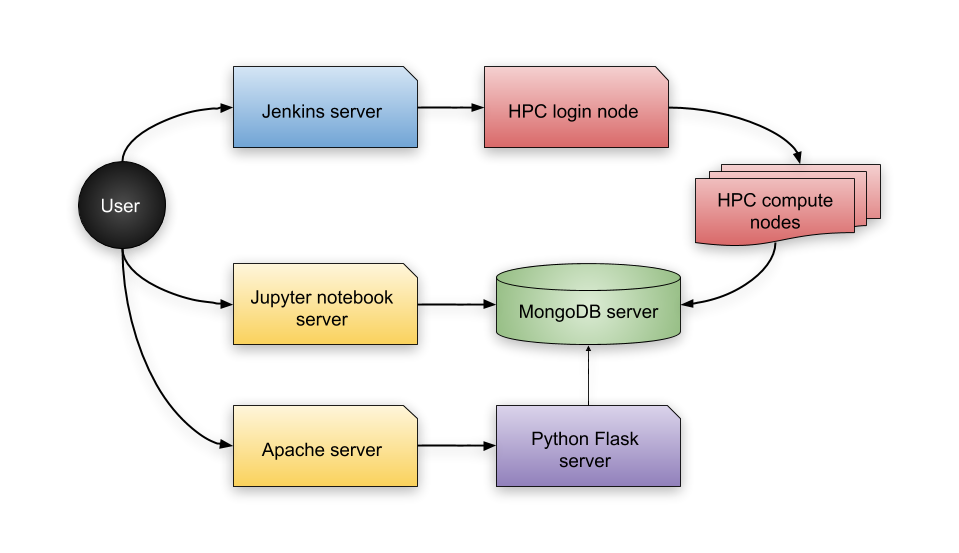

# CI-HPC Documentation & Installation

Installation process is not that simple, so sadly **you won't find here something like this**:
```bash
./configure && make && make install
```
Perhaps in the future installation will be easier... but 
if you know, what you are doing, you can setup your project within 15 minutes.


In order to install CI-HPC framework, please understand its structure first:



From the illustration above, you can see there are several servers.

1. With <span style="color: darkblue">BLUE</span> color is a Jenkins server.
    This server is in charge of git repository checking. If Jenkins detects
    any change in repository, it will contact an HPC login node to starts off
    the installion and testing of your project.

2. HPC system (in a <span style="color: darkred">RED</span> color)
      consist of 2 parts:
      
    1. The *login* node will translates what is Jenkins trying to do and will
    prepare a PBS job, that will install your project and after that 
    run your benchmark for your project.

    2. The *compute* nodes, that will take care of the installation and testing and
    when they are done, they will store the results to a database.

3. The database server (in a <span style="color: darkgreen">GREEN</span> color) 
     has a MongoDB database running and stores and loads benchmark results.

4. You have 2 options when it comes to visualising your results
   (both options are marked with <span style="color: darkorange">YELLOW</span> color):
   
    1. The first option (slightly easier but not by much) is (*probably 
    soon to be deprecated* Jupyter Notebook server. This solution offers great 
    customization but requires knowledge about Python and some python's scientific packages.

    2. The seconds option, interactive website, offers more interactivity and better visualisation.
    Thanks to `highcharts` js framework, you have plenty of options for 
    your charts. You can zoom in thre results, filter the series or simply
    (by clicking) go to the commit, which you are interested in.
  
5. Along interactive website, you need to have additional server running 
    (the data need to get to the web page somehow), and this is why there
    is this last server (in <span style="color: purple">PURPLE</span> color).
    It has a `python flask` server running, which is serving the data
    from the database back to the website.

   
## Prerequisites
Before configuring anything, make sure you have:
  1. an access to the HPC node (login preferable via `SSH Key-Based Authentication`).
  2. an access to a CI server such as Jenkins or other similar tool. If you have no such server available, `CRON` *may* suffice.

  3. an access to the database server, for now only MongoDB is supported. You can get free hosting on [MongoDB Atlas](https://www.mongodb.com/cloud/atlas) for up to 500MB.

  4. an access to a jupyter notebook server for visualisation. For education
     purposes [Azure notebooks](https://notebooks.azure.com) is possible option.
  
     or 
     
     access to a web server and access to a flask server. Flask server can be
     isntalled easily via `pip` packaging tool.


   *Note:* Jenkins server, Database server and visualisation servers can be 
   running on single computer.


## 1. Jenkins configuration
<!--   -->

Read the section about Jenkins configuration [here](jenkins-conf.md).


## 2. HPC configuration
Read the section about HPC configuration [here](hpc-conf.md) and 
the section about `config.yaml` config file [here](config.yaml.md) and 


## 3. MongoDB configuration
 

Read the section about MongoDB storage configuration [here](mongodb-conf.md)

## 4. Flask configuration
 

**TBD** ~~Read the section about Flask visualisation [here](flask-conf.md)~~

## Jupyter configuration
 

**TBD** ~~Read the section about Jupzter notebook visualisation [here](jupyter-conf.md)~~
