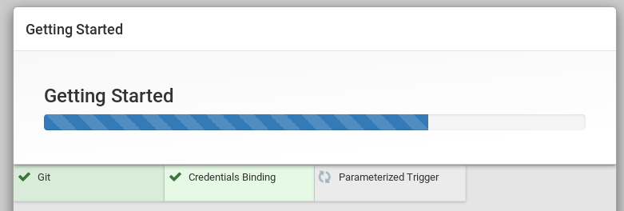
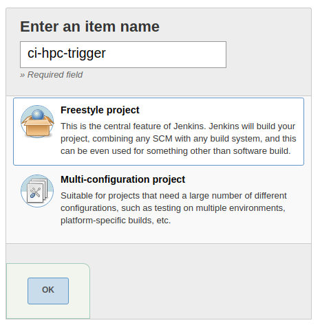
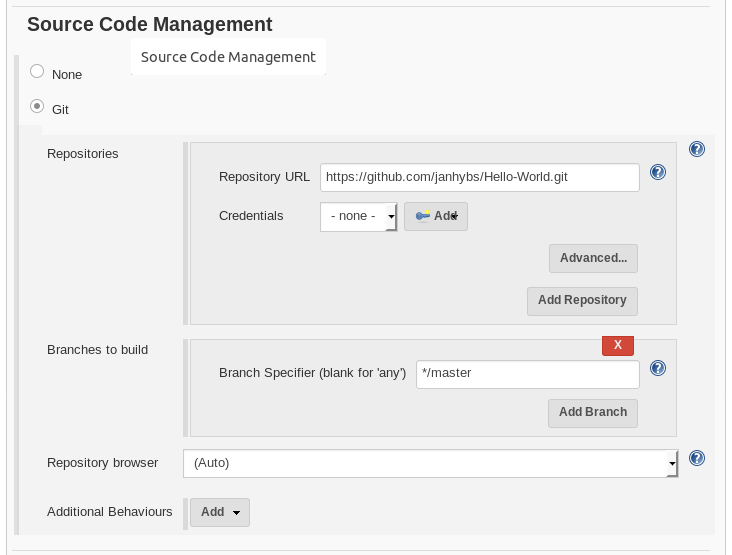
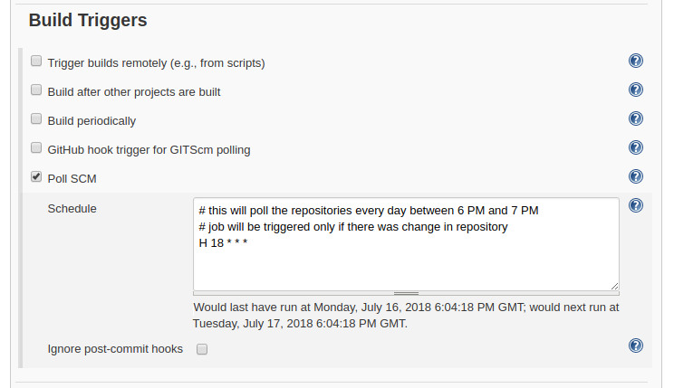
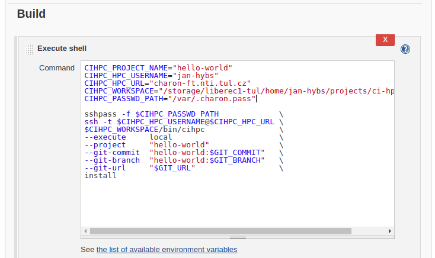
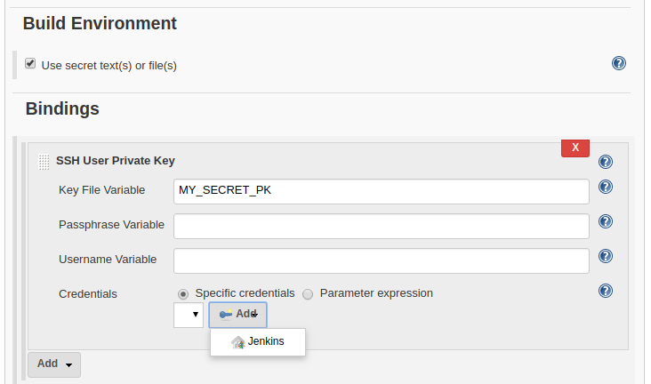
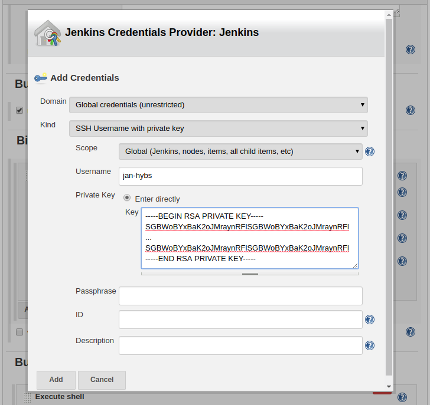

# Installing a Jenkins server
  1. Install Jenkins server on your server [manually](https://wiki.jenkins.io/display/JENKINS/Installing+Jenkins+on+Ubuntu) or use docker solution like [this](https://github.com/jenkinsci/docker) or [this](https://jenkins.io/doc/book/installing/#downloading-and-running-jenkins-in-docker)
  
      Hopefully you should see something like this in your browser:
      
      

  2. Configure Jenkins installation. No need to install all the plugins, but make sure you have the following plugins installed:
      1. `Git`
      2. `Credentials Binding`
      3. `Parameterized Trigger`

          

# Configuring a Jenkins server
  1. Create new Job (type can be `Freestyle project`)
  
      

  2. Setup git connection to your repository
      

  3. Make sure `Poll SCM` is set (CRON syntax)
  
      *Note:* The value `H 18 * * *` translates to daily, between 6PM to 7PM
      

  4. Add Shell `Build` step to your project:
  
      You can write your own script for starting cihpc but the most common 
      scenarios are listed here. At the start of the `Build` step include your.
      project configuration:
      
      ```shell
      CIHPC_PROJECT_NAME="hello-world"
      CIHPC_HPC_USERNAME="jan-hybs"
      CIHPC_HPC_URL="charon-ft.nti.tul.cz"
      CIHPC_WORKSPACE="/storage/praha1/home/jan-hybs/projects/ci-hpc"
      ```
      
      
      - when using *SSH Key-Based Authentication*:
          Setup [key-based SSH login](https://www.ssh.com/ssh/copy-id) to be able to login to an HPC server without password or ANY other prompts.
          
          ```shell
          mkdir -p ~/.ssh
          ssh-keyscan -H $CIHPC_HPC_URL > ~/.ssh/known_hosts
          
          ssh -t $CIHPC_HPC_USERNAME@$CIHPC_HPC_URL     \
            $CIHPC_WORKSPACE/bin/cihpc                  \
               --project     "hello-world"              \
               --git-commit  "hello-world:$GIT_COMMIT"  \
               --git-branch  "hello-world:$GIT_BRANCH"  \
               --git-url     "$GIT_URL"                 \
               --execute     local                      \
               install
          ```
          
          Make sure you connect to the server at least once or automatically add entry to the known_hosts using commands:
          
           ```
           mkdir -p ~/.ssh
           ssh-keyscan -H $CIHPC_HPC_URL > ~/.ssh/known_hosts
         ```
         
      - when using *Password authentication*:
         If your server does not support key-less login, you can use [`sshpass`](https://askubuntu.com/questions/282319/how-to-use-sshpass) (but it is not recommended as you need to keep your raw password somewhere on the server).
         
         *Note:* make sure `sshpass` is installed on the Jenkins server and that
         your file containing password has permissions like `0400` (read only for owner).
         
           ```shell
           mkdir -p ~/.ssh
           ssh-keyscan -H $CIHPC_HPC_URL > ~/.ssh/known_hosts
           
           CIHPC_PASSWD_PATH="/path/to/your/password-file"
           sshpass -f $CIHPC_PASSWD_PATH                    \
              ssh -t $CIHPC_HPC_USERNAME@$CIHPC_HPC_URL     \
                $CIHPC_WORKSPACE/bin/cihpc                  \
                   --execute     local                      \
                   --project     "hello-world"              \
                   --git-commit  "hello-world:$GIT_COMMIT"  \
                   --git-branch  "hello-world:$GIT_BRANCH"  \
                   --git-url     "$GIT_URL"                 \
                   --execute     local                      \
                   install
           ```
           
       - when using *SSH Key-Based Authentication* (if you do not have access to the file system on Jenkins server, use `Credentials Binding` plugin)
        
          ```shell
          CIHPC_PASSWD_PATH="/path/to/your/password-file"
          
          mkdir -p ~/.ssh
          cp $MY_SECRET_PK ~/.ssh/id_rsa
          ssh-keygen -y -f ~/.ssh/id_rsa > ~/.ssh/id_rsa.pub
          ssh-keyscan -H $CIHPC_HPC_URL > ~/.ssh/known_hosts
          
           ssh -t $CIHPC_HPC_USERNAME@$CIHPC_HPC_URL     \
             $CIHPC_WORKSPACE/bin/cihpc                  \
                --project     "hello-world"              \
                --git-commit  "hello-world:$GIT_COMMIT"  \
                --git-branch  "hello-world:$GIT_BRANCH"  \
                --git-url     "$GIT_URL"                 \
                --execute     local                      \
                install
          ```
          
          Setup `Bindings`
          
          
          Add `SSH Username with private key` kind
          
  
# `cihpc` arguments
When calling `bin/cihpc` binary you can pass plenty of arguments (see the file),
but couple of them are worth mentioning in this section: 
  - arguments `install` and `test`
  
    If `install` is given, will run all the `steps` within the `install` section.
    If `test` is given, will run all the `steps` within the `test` section.
    
    Example:
    
    ```shell
    $> bin/cihpc --project=foo --execute local install
    ...
    processing project foo, section ['install']
    ...
    ```
    ```shell
    $> bin/cihpc --project=foo --execute local
    ...
    processing project foo, section ['install', 'test']
    ...
    ```
    
    *Note:* by default both `install` and `test` are set, meaning
    entire project is processed.
    
  - option `--execute`
  
    Valid values *for now* are either `local` or `pbs`. 
    If set to `local`, the script will execute given
    section(s) on a **login node**. This can be usefull
    when **installing** your software.
    Example:
    
    ```shell
    $> bin/cihpc --project=foo --execute local
    executing script tmp.entrypoint-1532530773-2c4e85.sh using local system
    ...
    ```
    *Note:* by default no system is set,
    you should **always** set which system to use.
    
    
