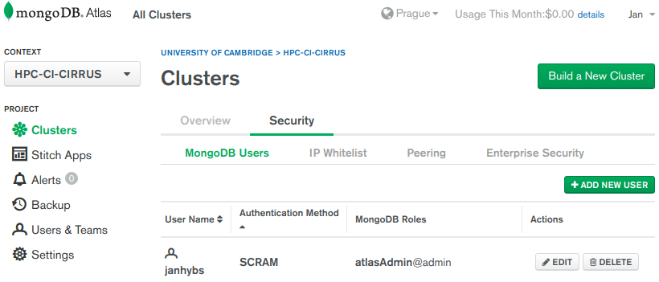
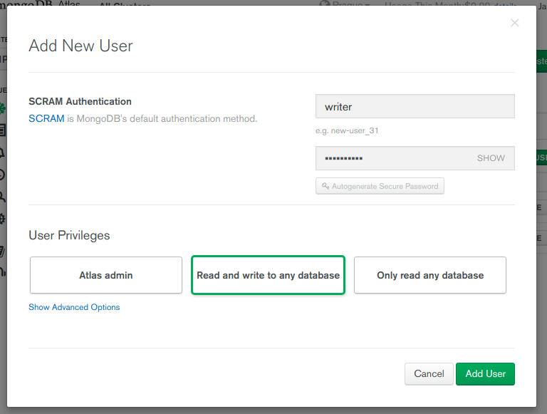

##  MongoDB configuration

Configuring MongoDB storage is basically just creating an user, which has 
permissions to read and write to a database.

When using [MongoDB atlas](https://cloud.mongodb.com) you setup your project.
By default you should have (or you should be asked to add) a user, which is in role of a admin.



It is recommended to add another user, who can write to any database:



After the user is created you need to create a file `secret.yaml` inside
`cfg` directory. **Make sure only owner can read this file** as it will contain username, password and server to the MongoDB database.

## `secret.yaml` structure

The file can contain configuration for multiple project, the main section is same as
the name of your project (e.g. `hello-world`). To setup connection to a db server
create section `database`This section can contain several options but all of them are passed
to the construcotr of the python's 
[pymongo.mongo_client.MongoClient constructor](https://api.mongodb.com/python/current/api/pymongo/mongo_client.html#pymongo.mongo_client.MongoClient). Please refer to [api.mongodb.com](https://api.mongodb.com/python/current/api/pymongo/mongo_client.html#pymongo.mongo_client.MongoClient) for further information.

Take a look at the example of the `secret.yaml` file [here](../cfg/secret.template.yaml).

If your MongoDB server is not hosted, you must setup MongoDB authorization (for example via `/etc/mongodb.conf`):

```yaml
# /etc/mongodb.conf
net:
  bindIp: 0.0.0.0
  port:   27017

security:
  authorization: enabled
```

### `secret.yaml` examples
  1. Example 1 (single host):
      ```yaml
      hello-world:
        database:
          host:           [mongodb.server.example.com:27017]
          connect:        true
          authSource:     admin
          username:       writer
          password:       password-here
      ```

  2. Example 2 (mongodb configuration with 3 hosts):
      ```yaml
      hello-world:
        database:
          host:
            - cluster0-shard-00-00-foobar.mongodb.net:27017
            - cluster0-shard-00-01-foobar.mongodb.net:27017
            - cluster0-shard-00-02-foobar.mongodb.net:27017
          replicaSet:     Cluster0-shard-0
          connect:        true
          authSource:     admin
          authMechanism:  SCRAM-SHA-1
          ssl:            true
          username:       writer
          password:       password-here
      ```


      
If `secret.yaml` is setup properly, you can easily collect benchmark data to
a database. By default the data will be saved into a database with the name
of your project name. You can change this behaviour by adding another section
to the `secret.yaml`:

```yaml
hello-world:
  artifacts:
    db_name:          customDbName      # name of the database to save date to
    
    col_timers_name:  customRepColName  # name of the collection which will contain
                                        # benchmark data (reports, frames)
    
    col_files_name:   customFSColName   # name of the collection which will contain
                                        # files and logs when error during run occured
```

*Note:* Assuming we are trying to override artifacts location fot the 
project `hello-world`

**TBD** ~~a section about an aggregation pipeline here~~
